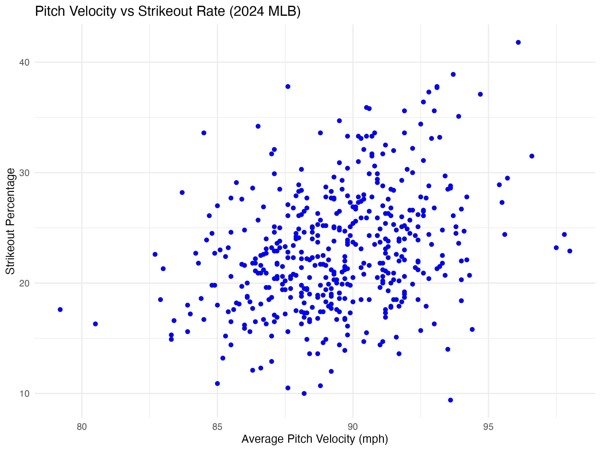
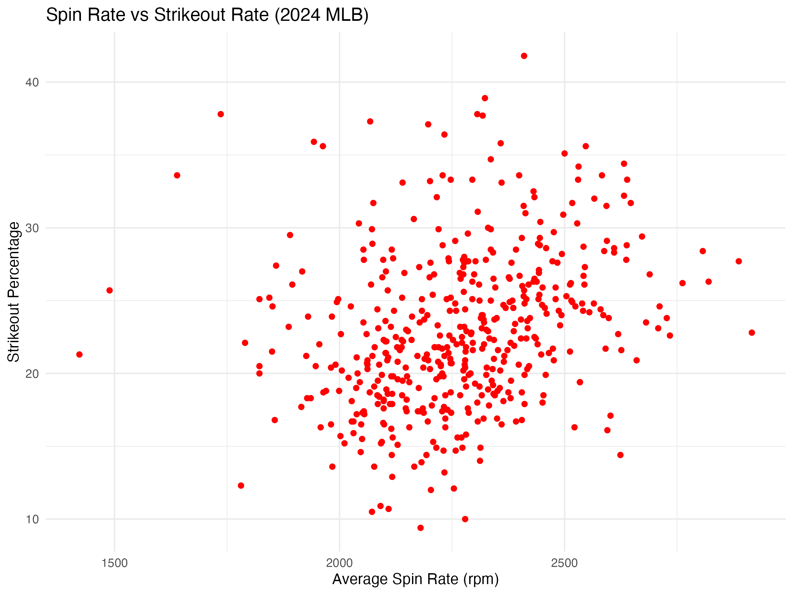

# MLB Pitching Analysis: Velocity, Spin Rate, and Strikeouts

## Overview
This project analyzes MLB Statcast pitching data from the 2024 season to investigate how pitch characteristics influence strikeout rates among pitchers.

Using Baseball Savant data, this analysis explores whether pitch velocity and spin rate are associated with higher strikeout percentages.

## Data Source
The dataset was obtained from MLB Statcast through the Baseball Savant Statcast Search tool.

## Methods
The analysis was conducted in R using the tidyverse and ggplot2 libraries.

Steps included:
- Cleaning and filtering the dataset
- Removing pitchers with fewer than 500 pitches
- Exploratory data visualization
- Linear regression modeling

## Variables Examined
- Pitch Velocity
- Spin Rate
- Strikeout Percentage (K%)
- Hard Hit Percentage
- Barrels per Batted Ball Event

## Tools Used
- R
- tidyverse
- ggplot2
- MLB Statcast Data

## Visualizations

