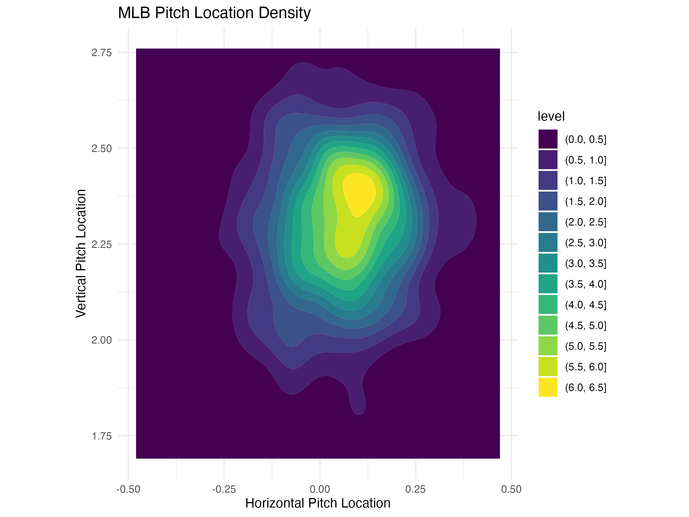
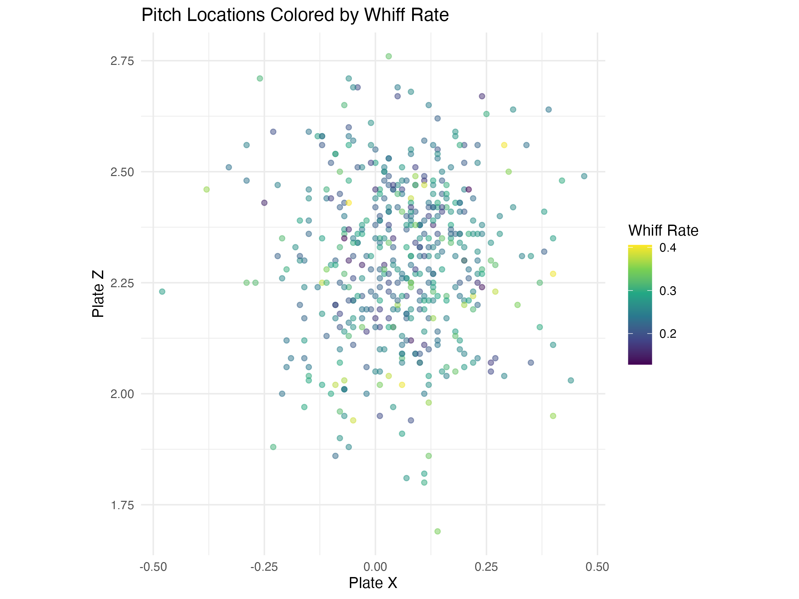
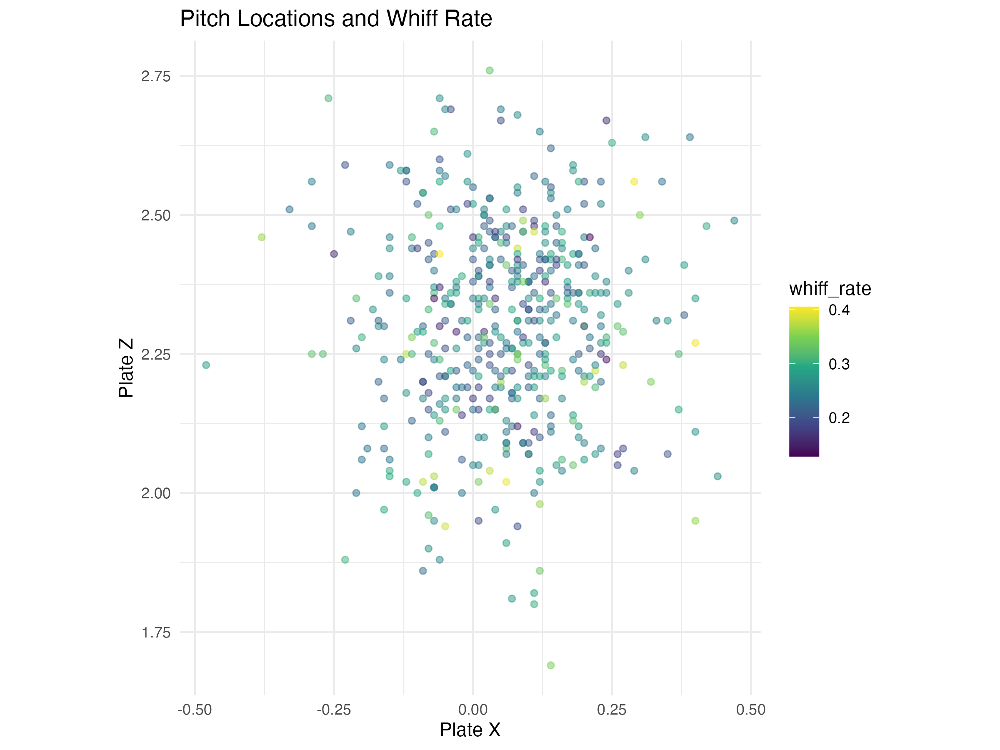

# MLB Pitching Breakdown

This project analyzes MLB Statcast pitching data using R to explore how pitch characteristics influence strikeouts and whiffs.

## Dataset
Statcast pitching data from Baseball Savant.

## Project Goals
The goal of this project is to investigate how pitch velocity, spin rate, and pitch location relate to strikeout and whiff outcomes.

---

# Visualizations

## Velocity vs Strikeouts
Relationship between pitch velocity and total strikeouts.

---

## Spin Rate vs Strikeouts
Examining whether higher spin rates correlate with more strikeouts.

---

## Pitch Location Density
Density of pitch locations across the strike zone.

---

## Pitch Location and Whiff Rate
Pitch locations colored by whiff rate.

---

## Pitch Locations and Whiffs
Visualization showing how pitch location relates to swing-and-miss outcomes.

---

# Tools Used
- R
- tidyverse
- ggplot2
- MLB Statcast data
